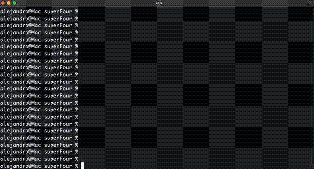

# SuperFour 🎮

SuperFour is a simple **Connect Four** game implemented in **Java**.  
Two players (Human vs Bot) take turns dropping pieces into a 6×7 board.  
The first player to align four pieces **horizontally, vertically, or diagonally** wins!

---
## 🕹️ How to Play
1. Start the game.
2. The board is printed with **columns 1–7**.
3. On your turn, type a number (1–7) to drop your piece in that column.
4. The bot will then play its move.
5. The game continues until there is a winner or the board is full.

---

## ✨ Features
- 6×7 board (classic Connect Four rules)
- Human vs Bot gameplay
- Bot logic: tries to win immediately, otherwise picks a random column
- Winner detection in all directions
- Utility methods for board printing, move validation, and piece dropping
- Basic unit tests with **JUnit 5**

---

## 📦 Requirements
- Java 23+ (works with 11, but recommend 17+)
- Maven 3.x

---

## 🚀 How to Run


Clone the repository:
```bash
git clone https://github.com/your-username/superfour.git
cd superfour
```

### Build the project
```bash
mvn clean package
```
### Run the game

Run the packaged jar directly:
```bash
java -cp target/superfourgame-1.0-SNAPSHOT.jar org/games/superfour/Main
```

---


## 🧪 Tests
Run them with:
```bash
mvn verify
```
---

## 🙌 Future Improvements
- Smarter bot with defensive moves (blocking human wins)
- GUI
- Multiplayer mode
---

